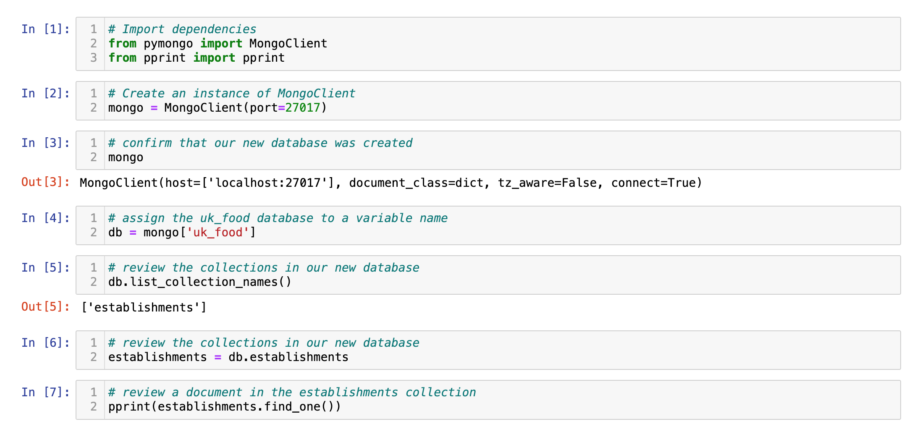
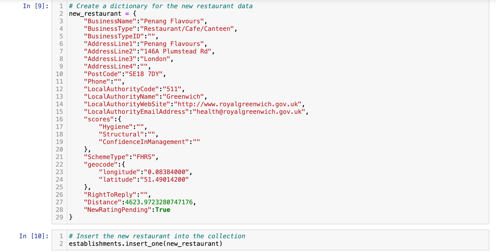
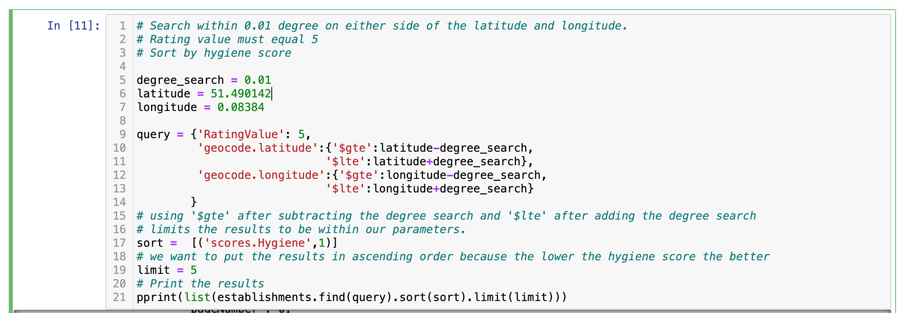
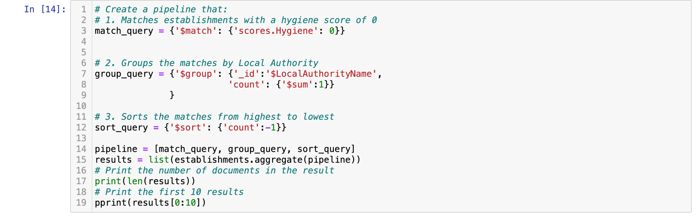

# NoSQL-challenge

## SETUP

1. Import the data provided in the establishments.json file from your Terminal. Name the database uk_food and the collection establishments. Import libraries into notebook. Create an instance of the Mongo Client. Confirm that you create the database.



2. Add a the new restaurant into the database.



3. update the BusinessTypeID of the new restaurant
```
query = {'BusinessType':'Restaurant/Cafe/Canteen'}
fields = {'BusinessType':1, 'BusinessTypeID':1}
results = list(establishments.find(query, fields))
pprint(results)

establishments.update_one({"BusinessName":"Penang Flavours"}, {
                                                                '$set': {
                                                                'BusinessTypeID':1}
                                                                })
```
4. remove all listings within the city of Dover

`establishments.delete_many({'LocalAuthorityName':'Dover'})`

## ANALYSIS

1. Which restaurants in the database have a hygiene score of 20?

```
# Find the establishments with a hygiene score of 20
query = {'scores.Hygiene': 20}

# Use count_documents to display the number of documents in the result
print(f'Number of documents with a hygiene score of 20: {establishments.count_documents(query)}')
# Display the first document in the results using pprint
results = establishments.find(query)
pprint(results[0])
```
- results were then converted into a pandas data frame

```
# Convert the result to a Pandas DataFrame
hygiene_df = pd.DataFrame(results)
# Display the number of rows in the DataFrame
print(len(hygiene_df))
# Display the first 10 rows of the DataFrame
hygiene_df.head(10)
```
2. Which establishments in London have a RatingValue greater than or equal to 4?

```
# Find the establishments with London as the Local Authority and has a RatingValue greater than or equal to 4.
query = {'LocalAuthorityName':{'$regex':'London'}, 'RatingValue':{'$gte': 4}}

# Use count_documents to display the number of documents in the result
results = establishments.find(query)
print(f'the number of London establishments with a rating value of 4 or greater: {establishments.count_documents(query)}')
# Display the first document in the results using pprint
pprint(results[0])
```
- Don't forget to convert the results to a data frame

```
# Convert the result to a Pandas DataFrame
london_df = pd.DataFrame(results)
# Display the number of rows in the DataFrame
print(f'number of rows: {len(london_df)}')
# Display the first 10 rows of the DataFrame
london_df.head(10)
```

3. What are the top 5 establishments with a RatingValue rating value of 5, sorted by lowest hygiene score, nearest to the new restaurant added, "Penang Flavours"?



- results were dataframed

4. How many establishments in each Local Authority area have a hygiene score of 0?



- pd.dataframe(results) you already know


